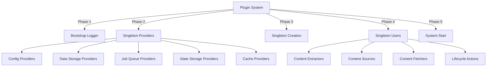
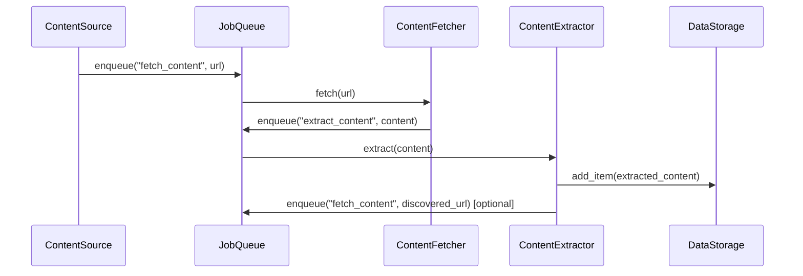
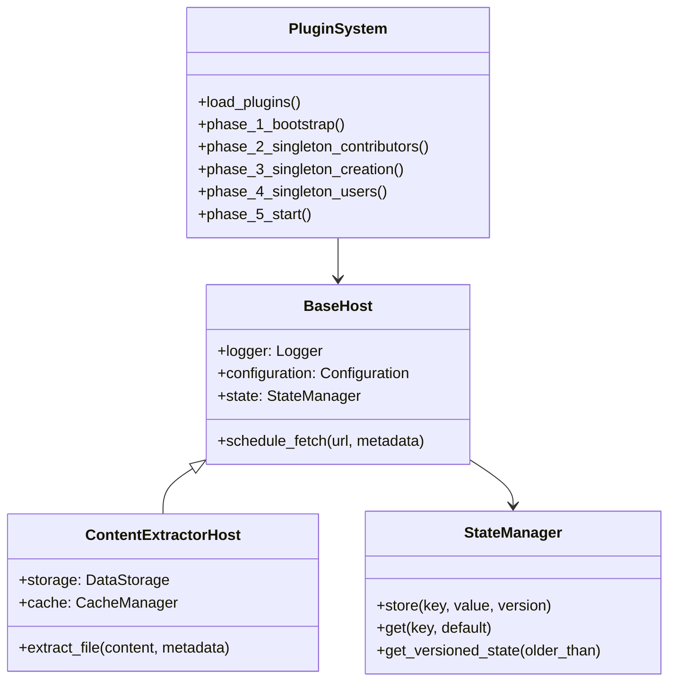
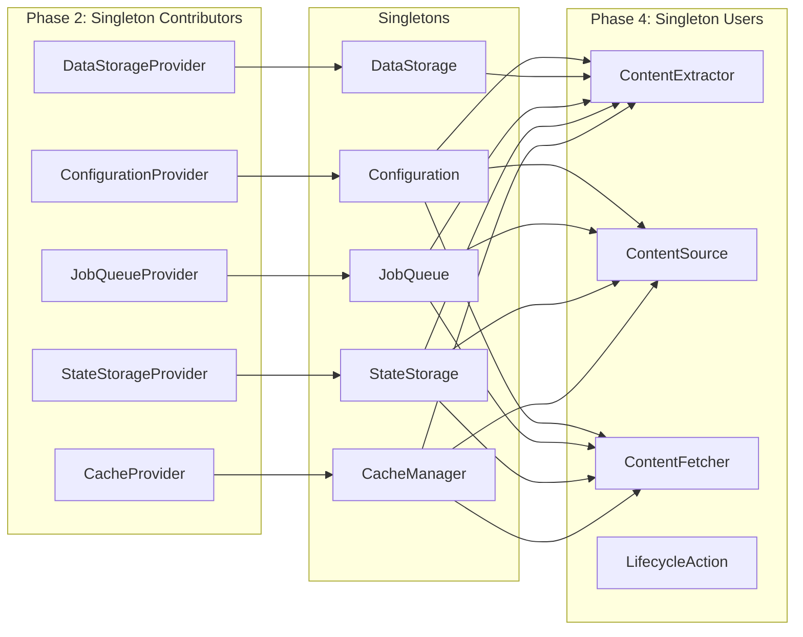
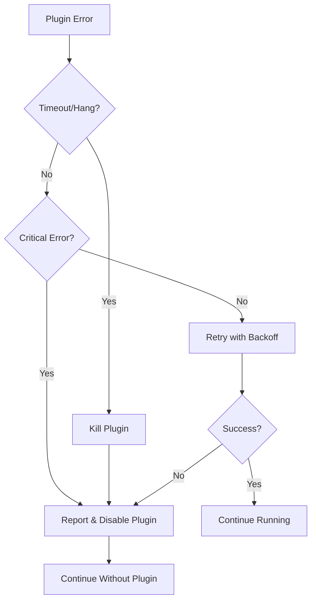
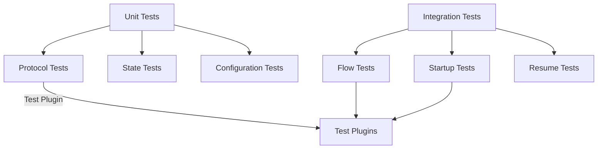

# System Patterns

## Purpose of this file
- System architecture
- Key technical decisions
- Design patterns in use
- Component relationships
- Critical implementation paths

## Core Architecture Patterns

### Plugin System Architecture

### Extension Point Pattern
- **Protocol-Based Interfaces**: Use `typing.Protocol` for structural typing
- **Registration Hooks**: Separate `@hookimpl` registration for each extension type
- **Host Interface Pattern**: Base host with specialized extensions for each extension type

### Data Flow Pattern

## Key Design Decisions

### 1. Phased Startup Sequence
**Decision**: Use 5-phase startup to handle singleton dependency ordering
**Rationale**: Some plugins contribute singletons, others consume them - phases ensure proper initialization order
**Implementation**: Bootstrap → Singleton Contributors → Singleton Creation → Singleton Users → Start

### 2. Protocol-Based Extension Points
**Decision**: Use `typing.Protocol` instead of inheritance
**Rationale**: Structural typing allows more flexible implementations and better type checking
**Implementation**: Each extension point defined as Protocol with runtime validation

### 3. Job Queue Processing
**Decision**: Route most operations through job queue system
**Rationale**: Enables asynchronous processing, resumability, and better resource management
**Implementation**: Multiple job queue providers (synchronous for dev, persistent for production)

### 4. Automatic State Partitioning
**Decision**: Partition plugin state by module name automatically
**Rationale**: Prevents state conflicts between plugins without requiring explicit namespacing
**Implementation**: StateManager uses plugin module name as partition key

### 5. Base Host Class Pattern
**Decision**: Common base host with specialized extensions
**Rationale**: Shared functionality (logging, config, state) with type-specific additions
**Implementation**: BaseHost + ContentExtractorHost, ContentSourceHost, etc.

### 6. Immutable Data Structures
**Decision**: Use frozen dataclasses with copy/merge methods
**Rationale**: Prevents accidental mutations and enables safe concurrent access
**Implementation**: `@dataclass(frozen=True)` with `copy(**changes)` and `merge(patch)` methods

### 7. Configuration Merging Strategy
**Decision**: Merge plugin defaults with user overrides, concatenate lists
**Rationale**: Allows plugins to provide sensible defaults while enabling user customization
**Implementation**: Plugin-to-plugin merging (last wins), user overrides all, list concatenation

### 8. Configuration Integration Strategy
**Decision**: Integrate configuration system with plugin registration using factory pattern
**Rationale**: Enables plugins to provide default configurations merged with user overrides in application-wide singleton
**Implementation**: ConfigurationFactory creates configuration from plugins + user config, validate_configuration_provider ensures protocol compliance

## Component Relationships

### Core Components

### Extension Point Relationships

## Critical Implementation Paths

### Plugin Discovery Path
1. **Scan paise2 codebase** for `@hookimpl` decorated functions
2. **Use pluggy's discovery** for external plugins
3. **Load in discovery order** within each phase
4. **Validate Protocol compliance** at runtime

### Content Processing Path
1. **ContentSource** identifies content and calls `schedule_fetch()`
2. **Host** creates "fetch_content" job via job queue
3. **Job worker** picks up job and selects appropriate ContentFetcher
4. **ContentFetcher** fetches content and calls `extract_file()`
5. **Host** creates "extract_content" job via job queue
6. **Job worker** picks up job and selects appropriate ContentExtractor
7. **ContentExtractor** processes content and stores results

### State Management Path
1. **Plugin requests state** via `host.state`
2. **StateManager** automatically partitions by plugin module name
3. **StateStorage** handles actual storage with partition key
4. **Version tracking** enables re-indexing when plugins update

### Configuration Merging Path
1. **Collect plugin defaults** from ConfigurationProviders
2. **Merge plugin configurations** (later plugins override earlier)
3. **Load user configuration** files
4. **User settings override** plugin defaults completely
5. **Provide merged configuration** to all plugins via host

### Configuration Integration Path
1. **Plugin provides ConfigurationProvider** via @hookimpl decorated function
2. **PluginManager validates provider** using validate_configuration_provider method
3. **ConfigurationFactory collects providers** during singleton creation phase
4. **Plugin defaults merged** using ConfigurationManager.merge_with_user_overrides
5. **User configuration overrides** plugin defaults completely
6. **Application configuration created** as singleton accessible by all plugins via host
7. **Plugins access configuration** through host.configuration property

## Error Handling Patterns

### Phase 1: Fail Fast (Current)
- Plugin failures halt system startup
- Immediate feedback for development
- Simplified debugging process
- Clear error reporting

### Phase 2: Isolation (Future)

### Error Categories
- **Configuration errors**: Invalid plugin configuration
- **Runtime errors**: Plugin crashes during operation
- **Resource errors**: Plugin exhausts system resources
- **Network errors**: Plugin fails to fetch external content
- **Job processing errors**: Failures in job queue processing

## Testing Patterns

### Plugin Testing Strategy

### Test Infrastructure Components
- **TestPluginSystem**: Simplified plugin system for testing
- **Mock Hosts**: Test implementations of host interfaces
- **Test Providers**: Minimal implementations of singleton providers
- **Test Simulacra**: Simple plugins demonstrating each extension point
